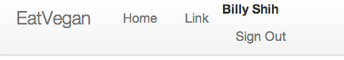
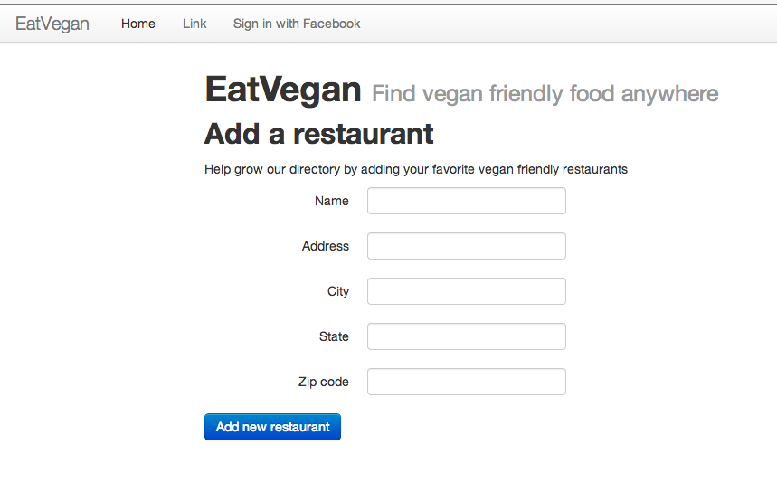

# Eat Vegan

A website to help track vegan friendly restaurants.

One of the hardest parts of being vegan is finding a restaurant that is vegan friendly. Because of this, I see this as a tool to make a good behavior easier and more sustainable.

Bus apps made it possible for me to learn to ride the bus and make it easier to live without a car. I hope to help others become and stay vegan :)

## How this was implemented
Created CRUD from scratch and implemented bootstrap and simple forms. I need to create more tests but otherwise it's working nicely.

## Facebook login working:

---
Uncopyright

All code on this repo created by me, Billy Shih, is released to the public domain.

No permission is needed to copy, distribute, or modify the content of this site.

Attribution is appreciated but not required.

[Inspired by Leo Bauta.](http://zenhabits.net/uncopyright/)
